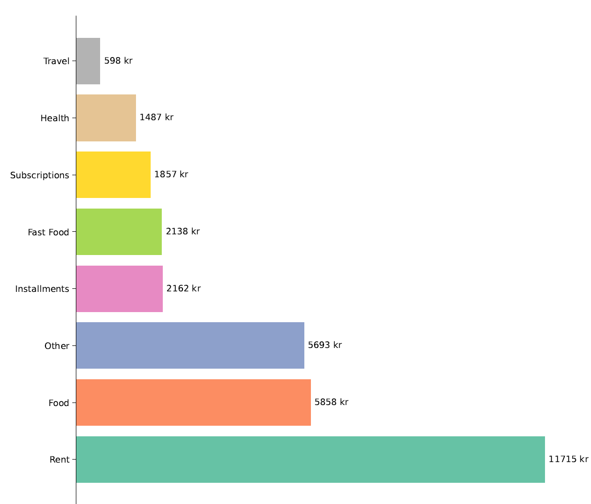
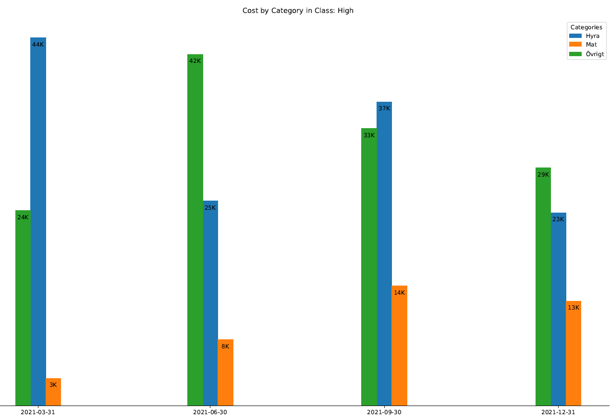
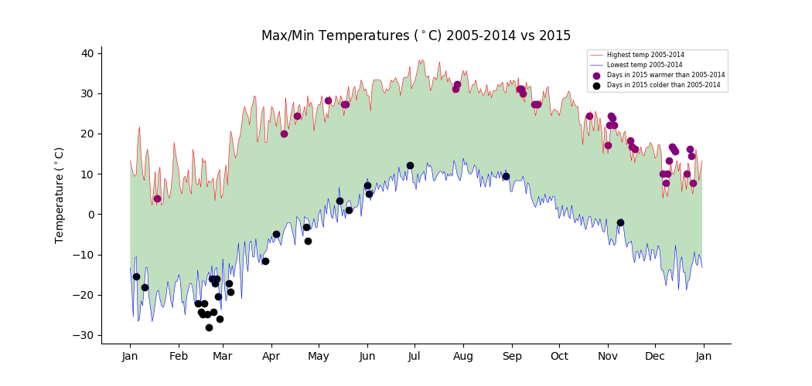
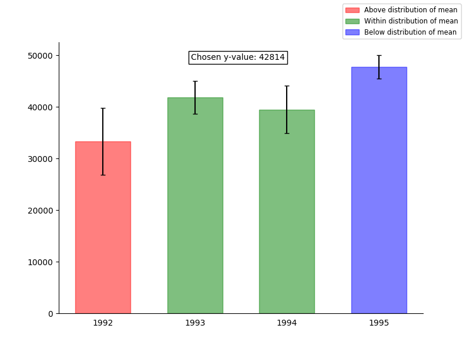

## About me
During the pandemic I decided that I wanted to find and learn a new skill that was unrelated to my educational and professional background. Evidently in april of 2021 this finally led me to programming. Specifically Python for Data Analysis.

Ever since then I have spent evenings after work and weekends to continue my learning journey of the language. My Python education so far have specifically been through courses taught by various universities via [Coursera](https://www.coursera.org/)

My goal is becoming a proficient data scientist with an orientation towards machine learning. 

Below are my current projects in which *Expenditure Analysis* is my most recent work. I'm currently studying Data Science via Coursera.

## [Project 1 - Expenditure Analysis](https://github.com/dolkt/expenditure_analysis)
A program built to be run via command line.

The program has **two** functionalites.
1. Takes a raw transactionfile, cleans the data and places each transaction into a predefined category based on the textual data of each transaction. It then uploads the data to a local database.
2. Produces a Expenditure Report for a given time interval. The Expenditure Report can either be visualized on a one-month basis or as a quarter-by-quarter report for a given time interval.

The purpose of Expenditure Analysis is to give the user a better understanding of their expenditures. This understanding can be used to identify unwanted spending patterns, i.e if the user spends too much money on a certain category.

The categorized costs can be tracked over time with the monthly and quarterly report in order to see if the user is able to successfully change their previously (unwanted) spending patterns.

  
  

## [Project 2 - Weather Pattern Plotting](https://github.com/dolkt/weather_patterns)
This project was part of a Data Science course taught at University of Michigan via [Coursera](https://www.coursera.org/account/accomplishments/verify/KXMWBY8QBZMA).

Utilizing a chosen weather station, the objective was to:

1. Plot the record lowest and highest temperature for each day in a month for the period 2004 - 2014
2. Do a conditional overlay of a scatter plot showing the record lowest and highest temperatures for each day in a month in 2015 where the temperatures were even lower than the record lowest/highest in 2004 - 2014.
3. Miscellaneous data cleaning / data manipulation. Such as handling erroneous data.

  
 

## [Project 3 - Interactive Plots](https://github.com/dolkt/interactive_plot)
This project was part of a Data Science course taught at University of Michigan via [Coursera](https://www.coursera.org/account/accomplishments/verify/KXMWBY8QBZMA).

The goal of this project was to utilize events in Matplotlib in order to build interactive plots.

The objective was:

1. Plot random data into 4 differing categories.
2. Plot with whiskers the mean and the calculated error margin of each category defined in step (1)
3. Build interactivity where the user selects a y-value and the bar coloring changes depends on if the chosen y-value is within or outside the distribution of the mean for each bar.

